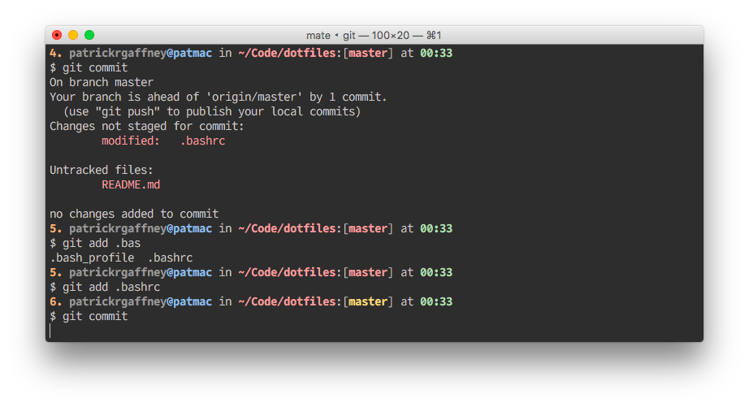

# just some dotfiles...



## Installation

The following will download the files to your current directory and create symlinks for the important stuff to `$HOME`. Some care should be taken to (at minimum) change the settings in the `.gitconfig` file, which are very opinionated — for starters, they assume you share my name and email.

```bash
git clone https://github.com/patrickrgaffney/dotfiles.git && sh dotfiles.sh
```

## Program Support

### `bash`

Three files:

- `.bash_profile`: basically just defers all the work to `.bashrc`.
- `.bashrc`: sets shell options, behavior, variables, prompt, and aliases
- `.inputrc`: sets `readline` keymaps and run-time behaviors

All of the good stuff is in `.bashrc`.

### `git`

There is support for *colored* branch names in your git prompt — these take one of the following forms (when inside of a repository), in order of precedence:

1. Repo is dirty (*red* branch name)
2. Repo has files in the staging area (*orange* [really cyan] branch name)
3. Repo is ahead of remote (*yellow* branch name)
4. Repo is clean (*green* branch name)

The states are determined by parsing the output from `git status` using `bash`'s *wonderful* pattern matching and parameter expansion. There are two functions in `.bashrc` that do this heavy lifting:

- `git_branch()`: parses `git branch` to determine current branch name
- `git_dirty()`: parses `git status` to determine current repo state (one of the above 4 states)

### Terminal.app

I am a religious user of Terminal.app — I have yet to bite from the [iTerm](https://iterm2.com/news.html) apple.

The `eighties.terminal` plist contains the settings I use for my everyday sessions. It borrows most of its theme from [Chris Kempson's](https://github.com/chriskempson) excellent [Tomorrow Night Theme](https://github.com/ChrisKempson/Tomorrow-Theme). 

It is important to note that all of the ANSI terminal colors are self-explanatory save for Cyan and Cyan Bright — both of these are shade of orange. This makes it easier to use 4 different states for the `git` prompt (see above): red, orange, yellow, and green.

### Textmate

Currently, `mate` is used (with a slew of arguments) as the default `GIT_EDITOR`. A global `.tm_properties` file is in the works, just haven't finished going through and cleaning up my defaults.

### `nano`

More to come on this.